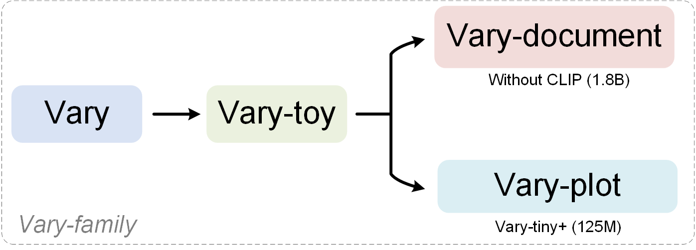

## Vary-family

## Notes
- 🔥Vary-document and Vary-plot are two models devised based on Vary-toy. We cannot open-source them, and we only use this repo to show the very strong results and discuss them.
- Specifically, Vary-document is a model whose performance is very close to [mathpix](https://github.com/blaisewang/img2latex-mathpix), and Vary-plot is a model better than [deplot](https://research.google/pubs/deplot-one-shot-visual-language-understanding-by-plot-to-text-translation/). What's more, our models support Chinese!
